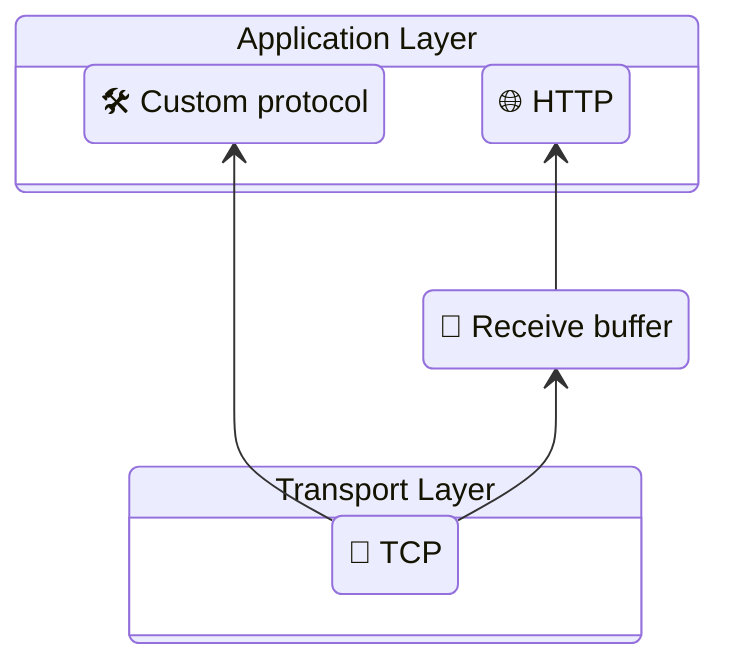

# 🦞 trawl


Exploring networking layers in **C** through **client–server** implementation.

---

### ℹ️ About
`trawl` is a hands-on networking project built to learn how **servers**, **clients**, and **network communication**
works in different layers, written in **C**.

[**Project Structure**](/docs/repo-structure.md)

---

### 📚 Sections
The project is organized into **sections**, each covering a specific concept or layer of abstraction.



[🛠️ Custom protocol](/docs/sections/custom_application_layer_protocol/custom_application-layer_protocol.md) |
[🌐 HTTP](/docs/sections/http/readme.md)

[📨 Receive buffer](/docs/sections/recv_buffer.md)

[🔌 TCP](/docs/sections/tcp/readme.md)

---

## 📦 Dependencies
- [CMake](https://cmake.org/)
- C compiler

---

## 🔧 Build and run

```bash
cmake -B build
```

> [!TIP]
> List the possible targets
> ```bash
> cmake --build build --target help
> ```

Build everything or a specific section:

```bash
cmake --build build
cmake --build build -t tcp-section
cmake --build build -t http         # build every section under http
```

Run a section's client or server:

```bash
./build/bin/(<parent-section>/)<section>/server
./build/bin/(<parent-section>/)<section>/client
```
