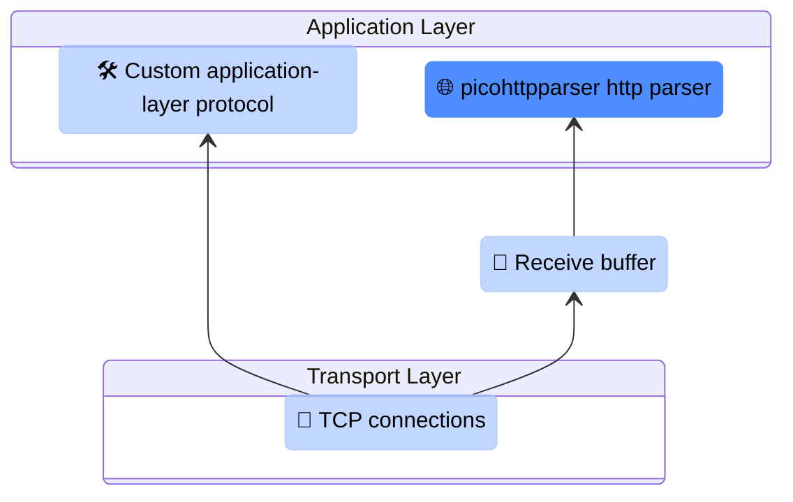

# 🦞 trawl


Exploring networking layers in **C** through **client–server** implementations.

---

### ℹ️ About
`trawl` is a hands-on networking project built to learn how **servers**, **clients**, and **network communication**
works in different layers, written in **C**. <br>

[**Read More**](/docs/repo-structure.md)

---

### 📚 Sections 
The project is organized into **sections**, each covering a specific concept or layer of abstraction. <br>
Sections can be **studied independently** in their **own branches**.



> [🛠️ Custom application-layer protocol](./docs/sections/custom_application-layer_protocol.md) <br>
> [🔌 TCP connections](./docs/sections/tcp_connections.md) <br>
> [📨 Receive buffer](./docs/sections/recv_buffer.md) <br>
> [🌐 picohttpparser http parser](./docs/sections/picohttpparser_http_parser.md)

---

## 📦 Dependencies
- [CMake](https://cmake.org/)
- Build system
- C compiler

---

## 🔧 Build and run
```bash
cmake -B build
cmake --build build
```

```bash
# server
./build/bin/trawld --help

# client
./build/bin/trawl --help
```

## 🐳 Dockerize
```bash
docker build -t trawl-server .
```

```bash
docker run -d -p 3000:3000 --name trawl-server trawl-server:latest
```
