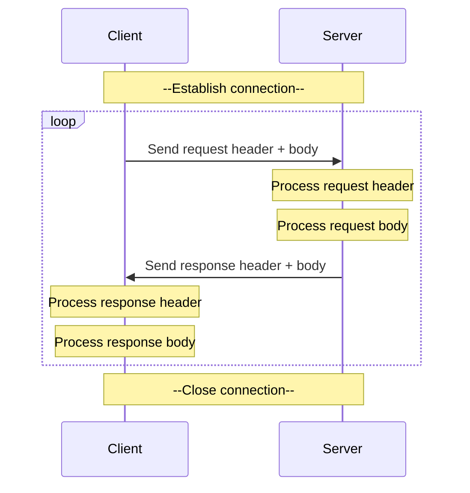

## 🛠️ Custom application protocol

### 🧠 Overview
This topic builds on top of the knowladge from
**[TCP connections](./tcp_connections.md)** section.

---

### 🎯 Purpose
Define rules between the **server** and the **client** to allow reliable data exchange.

---

### 👀 Visual / Mental Model

---

### ⚙️ How it works
Technical explanation (clear but deeper)

---

### 🔗 In the system
Where this fits in the bigger picture

---

### 🔎 Further reading
Links or references for deeper understanding

