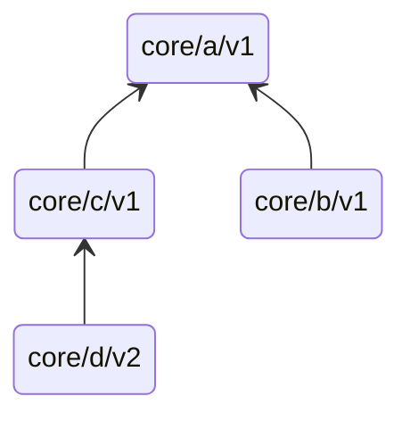

[< back](/README.md#-sections)

# Repository Structure

## Layout

```
.
├── core/
│   └── <section>/
│       └── <version>/   # e.g. core/tcp/v1/
└── app/
    ├── server/
    └── client/
```

| Path | Purpose |
|------|---------|
| `core/` | All section implementations, versioned by folder |
| `app/` | Consumes `core/` - imports specific section versions |

---

## Branches

`main` is the source of truth. Working branches are optional and short-lived. No permanent per-section branches.

---

## Sections

A section lives at `core/<name>/` and contains one or more version folders.

### Versioning

Version names follow [semver](https://semver.org/):

| Segment     | Tracked by         | Status                            |
|-------------|--------------------|-----------------------------------|
| Major       | Folder (`v{x}/`)   | Stable, permanent, safe as origin |
| Minor/patch | Git tag (`v{x}.y`) | No folder kep                    |

Major versions are permanent folders (e.g. `v1/`, `v2/`). <br>
Minor/patch changes are tracked as git tags on main (e.g. `core/http/v1.2`). <br>
Branches are used during development toward a new major version and deleted after merge to main.

- Each major version folder copies the previous version as starting point
- A breaking change 🢂 new major version folder (e.g. `v2/`)
- Each major version defines its fixed refrence manual explicitly (e.g. `refrence.md`)

### Subsections

Subsections are variants of the same concept at different abstraction levels, nested under the parent:

```
core/
  http/
    parser-lib/ 🢀 variant: use a public parser
      v1/
    own-parser/ 🢀 variant: implement your own
      v1/
```

Top-level sections are distinct concepts. Subsections are explorations of an existing one.

---

## Origins

A section may import another section from `core/` - this is its **origin**.

- Only stable versions (`v1.0+`) may be used
- Origin updates are manual and opt-in



---

## Lifecycle

```
1. Start from a stable origin or scratch
2. Implement under v0.x
3. Define refrence manual (refrence.md)
4. Promote to v1.0 when stable
```
