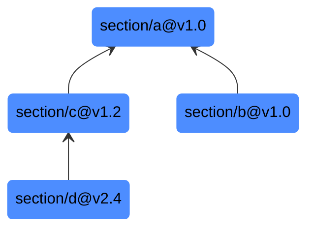

# Project Structure

This is an educational project.
Its goal is to document specific concepts and layers of abstraction by implementing them in isolated,
self-contained units called **sections**. Each section builds the same tools but may cover different features or approaches.

---

## Section Layout
```
.
├── core/       # Library code of sections the current branch builds on
├── app/
│   ├── server/ # Server source
│   └── client/ # Client source
```

`core/` is not a shared monolithic library. It contains only what the currently active section needs. `app/` consumes it.

---

## Branches
Each section lives on its **own branch**. Branches are independent and evolve separately. They are never merged into `main`.

```
main
section/a
section/b
section/c
...
```

### `main`
`main` does not contain runnable code for all sections. It serves two purposes:

1. **Index** - documents all sections and links to their branch or tag
2. **Showcase** - checks out one representative section as a concrete entry point for new readers

---

## Sections
A section is a self-contained implementation that documents a specific concept.
It lives on its own branch and is versioned independently.

### Versioning
Sections are tagged using [semver](https://semver.org/):

| Tag     | Meaning                                               |
|---------|-------------------------------------------------------|
| `v0.x`  | Unstable - do not use as an origin to another section |
| `v1.0+` | Stable - safe to use as an origin                     |

A tag is only considered **stable** when the section's public interface is intentionally defined and unlikely to change.
Stable tags are the contract.

### Interface Contract
Each section defines its public interface explicitly (e.g. in an `interface.md` or equivalent typed file).
This is reviewed before tagging stable. A change to the interface after a stable tag requires a **major version bump**.

---

## Origin Sections
Sections can be built on top of other sections.
This is means a section uses a stable tagged version of another section as its **starting point**.



This relationship is called an **origin**, not a dependency. It describes lineage, not a runtime requirement.

### Rules
- A section may only use a **stable tag** (`v1.0+`) as its origin
- The section with different origins across other versions will have documentation about the differences.
- If an origin section's interface changes after a major bump due to a critical bug,
dependent sections must be updated manually and re-documented

### Why Not `main`?
Because sections build on specific tagged versions of other sections -
not on whatever is currently on a branch - `main` cannot contain all of them simultaneously without conflict.
Each section's branch is the source of truth for that section.

---

## Documentation
Documentation is the primary deliverable of every section. <br>
If a section exists in two variants (e.g. built on different origin sections), the differences between those variants are documented explicitly.

---

## Lifecycle of a Section
```
1. Branch off from origin section at a stable tag (or from scratch)
2. Implement and document the concept
3. Define the public interface explicitly
4. Tag v0.x during development
5. Review interface → tag v1.0 when stable
6. Reference from main's index
```
