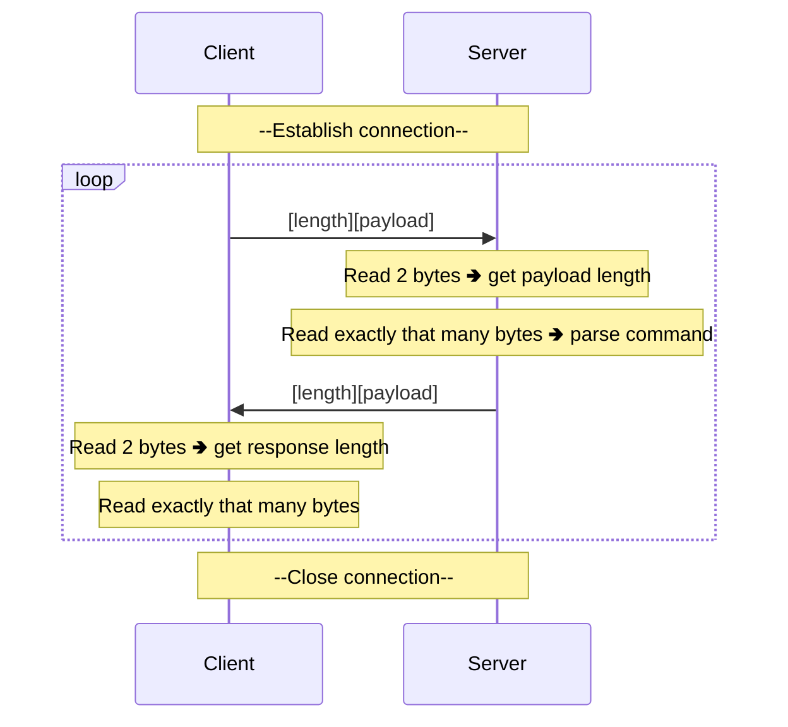

[< back](../../README.md)

## 🛠️ Custom application protocol
> [!NOTE]
> This topic builds on top of the knowledge from the **[TCP connections](./tcp_connections.md)** section.

### 🧠 Overview
A custom **application-layer protocol** defines the rules for how the **client** and **server** communicate on top of a raw
TCP connection.

TCP only guarantees that bytes arrive in order, it has no concept of messages or commands.
This protocol adds that structure by defining **how messages are framed** and **what commands are valid**.

---

### 🎯 Purpose
Define rules between the **server** and the **client** to allow reliable data exchange.

---

### 👀 Visual / Mental Model

---

### ⚙️ How it works
Every message follows the same **length-prefixed** format:

| length  | payload          |
|---------|------------------|
| 2 bytes | **length** bytes |

1. **Read length**
    - Read exactly **2 bytes** and interpret them as a `uint16_t`
    - This tells how many bytes the **payload** is (up to **65 535 bytes**).
2. **Read the payload**
    - Read exactly that many bytes.
3. **Parse the command**:
    - The **server** will send back data according to this table:

| Command   | Response                          |
|-----------|-----------------------------------|
| `help`    | Sends available commands          |
| `info`    | Sends server info                 |
| `<other>` | Echoes the payload back           |

4. **Respond**
    - The server sends a response in the **same format**: a `uint16_t` length prefix followed by the response payload.

---

### 🧩 In the system
This conecpt is at the **Application Layer (Layer 7)** of the network stack.

#### [OSI Model](https://en.wikipedia.org/wiki/OSI_model):
|   | Layer number | Layer           | Responsibility                                 | Protocol                 |
|---|--------------|-----------------|------------------------------------------------|--------------------------|
| 🢂 | **7**        | **Application** | **Data structuring**                           | **HTTP, FTP, DNS, SSH**  |
|   | 6            | Presentation    | Encoding, encryption, compression              | TLS/SSL, JPEG, ASCII     |
|   | 5            | Session         | Managing sessions between applications         | NetBIOS, RPC             |
|   | 4            | Transport       | End-to-end delivery, reliability, ports        | TCP, UDP                 |
|   | 3            | Network         | Logical addressing, routing between networks   | IP, ICMP, routing        |
|   | 2            | Data Link       | Node-to-node transfer, MAC addressing, framing | Ethernet, Wi-Fi (802.11) |
|   | 1            | Physical        | Raw bit transmission over physical medium      | Cables, radio, fiber     |

---

<!-- ### 🔎 Further reading -->
<!-- Links or references for deeper understanding -->
