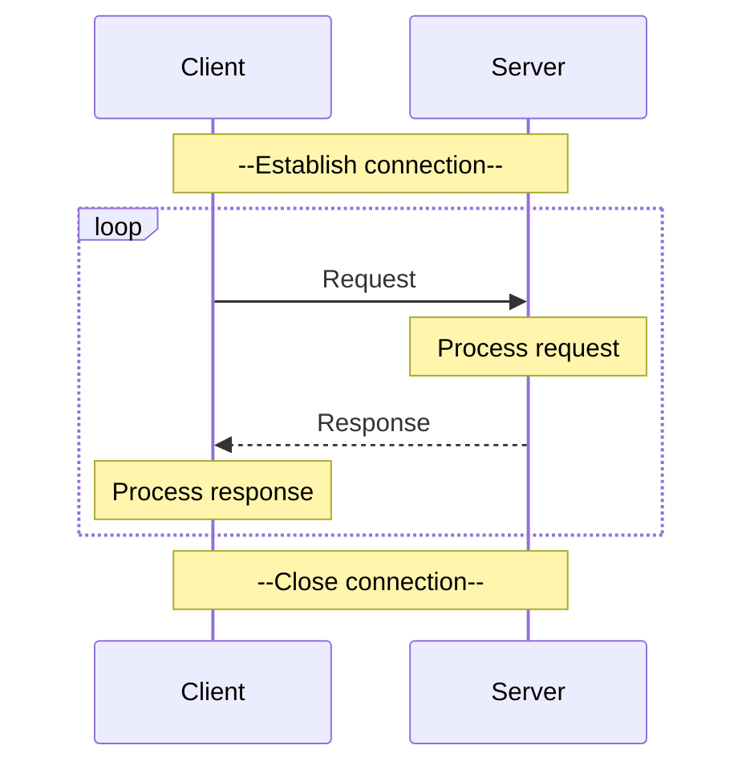

[< back](/README.md#-sections)

## 🌐 HTTP

### 🧠 Overview
HTTP (HyperText Transfer Protocol) is a request-response protocol used to transfer data over the web.

---

### 🎯 Purpose
- Structured messaging - defines a common format for requests and responses so any client can talk to any server
- Stateless communication - each request is independent; no session state is assumed on the transport level
- Resource addressing - URLs + methods (GET, POST, etc.) give a uniform way to identify and act on resources
- Content negotiation - headers let client and server agree on format, encoding, language, etc.
- Extensibility - custom headers and methods let you build on top without changing the core protocol

---

### 👀 Visual / Mental Model

---

### ⚙️ How it works
#### Example request
```
GET /index.html HTTP/1.1\r\n  |
Host: example.com\r\n         | Header
\r\n                          -
                              | No body
```
| Part           | Example        |
|----------------|----------------|
| Method         | `GET`          |
| Path           | `/index.html`  |
| Version        | `HTTP/1.1`     |
| Host           | `example.com`  |
| End of header  | `\r\n`         |

#### Example response
```
HTTP/1.1 200 OK\r\n     |
Content-Length: 12\r\n  | Header
\r\n                    -
Hello World!            | Content/Body
```
| Part           | Example        |
|----------------|----------------|
| Version        | `HTTP/1.1`     |
| Status code    | `200`          |
| Reason phrase  | `OK`           |
| Content-Length | `12`           |
| End of header  | `\r\n`         |
| Content/Body   | `Hello World!` |

---

### 🧩 In the system
HTTP sits at the application layer - it defines what is being communicated.

#### [OSI Model](https://en.wikipedia.org/wiki/OSI_model):
|   | Layer number | Layer           | Responsibility                                 | Protocol                 |
|---|--------------|-----------------|------------------------------------------------|--------------------------|
| 🢂 | **7**        | **Application** | **Data structuring**                           | **HTTP, FTP, DNS, SSH**  |
|   | 6            | Presentation    | Encoding, encryption, compression              | TLS/SSL, JPEG, ASCII     |
|   | 5            | Session         | Managing sessions between applications         | NetBIOS, RPC             |
|   | 4            | Transport       | End-to-end delivery, reliability, ports        | TCP, UDP                 |
|   | 3            | Network         | Logical addressing, routing between networks   | IP, ICMP, routing        |
|   | 2            | Data Link       | Node-to-node transfer, MAC addressing, framing | Ethernet, Wi-Fi (802.11) |
|   | 1            | Physical        | Raw bit transmission over physical medium      | Cables, radio, fiber     |

---

### 🔎 Further reading
[HTTP Semantics](https://www.rfc-editor.org/rfc/rfc9110.html) <br>
