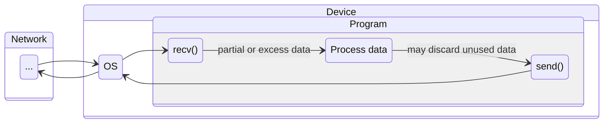
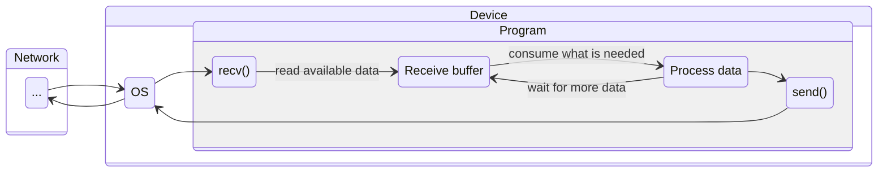

[< back](/README.md#-sections)

## 📥 Receive buffer

### 🧠 Overview
Instead of handling every message immediately, data is accumulated in **controlled and larger chunks**.

---

### 🎯 Purpose
- Improve performance by reducing `SYSCALLS` from repeated OS buffer reads.
- Provide better control over incoming data.

---

### 👀 Visual / Mental Model

#### Before


#### After


---

### ⚙️ How it works
The buffer is a byte array tracked by three fields: `start`, `len`, and `capacity`.

- **`start`** - offset to the first unconsumed byte
- **`len`** - number of available (unconsumed) bytes
- **`capacity`** - total allocated size

```
[consumed      | data (len)         | free space        ]
 ↑ buf          ↑ buf+start          ↑ buf+start+len     ↑ buf+capacity
``````

**Lifecycle:**

1. `recv_buffer_init` - allocates the backing buffer with a default capacity.
2. `recv_buffer_recv` - calls `recv()` into the free region (`buf + start + len`), growing `len`.
3. `recv_buffer_peek` - returns a read-only pointer to `buf + start`; no consumption.
4. `recv_buffer_read` - copies up to `n` bytes out, advances `start`, shrinks `len`.
5. `recv_buffer_compact` - shifts `buf[start..start+len]` back to `buf[0]`, resets `start` to 0. Called when free space is low but capacity is sufficient.
6. `recv_buffer_resize` - `realloc`s when even after compaction there isn't enough room.
7. `recv_buffer_free` - frees the backing buffer.

Data is never overwritten until explicitly consumed via `recv_buffer_read`.

---

### 🧩 In the system
A general-purpose buffer that sits between the **OS** and the **data processing** part,
smoothing out data flow without being tied to any specific networking layer.

---

<!-- ### 🔎 Further reading -->
<!-- Links or references for deeper understanding -->
