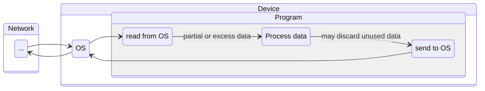
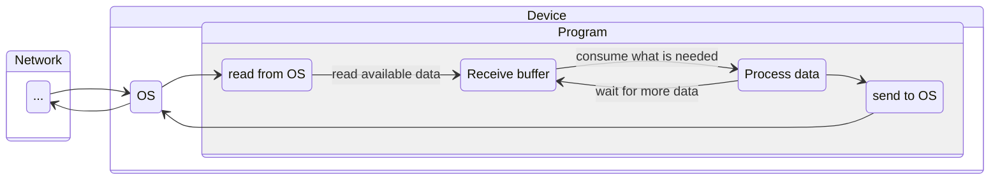

[< back](/README.md#-sections)

## 📥 Receive buffer

### 🧠 Overview
Instead of handling every chunk of data immediately, it is accumulated in **controlled and larger buffer**.

---

### 🎯 Purpose
- Improve performance by reducing `SYSCALLS` from repeated OS buffer reads.
- Provide more control over incoming data.

---

### 👀 Visual / Mental Model

#### Before


#### After


---

### ⚙️ How it works

`recv_buffer_t` is a sliding-window byte buffer that sits between your **socket layer** and your **protocol/parsing layer**. <br>
It absorbs raw incoming bytes and lets your app consume them at its own pace - no fixed-size reads, no manual shifting.

**The buffer has two key fields:**
- `start` - where unread data begins
- `len` - how many bytes are available

As you read, `start` advances forward. When space runs out at the back, `recv_buffer_compact()` slides the data back to the front. If there's still not enough room, it grows automatically (doubles, or fits the needed size).

**Typical usage flow:**

```c
// 1. Receive bytes from a socket directly into the buffer
recv_buffer_recv(&buf, 4096, fd, 0);

// 2. Peek at the data without consuming it (e.g. to check a header)
const uint8_t *data = recv_buffer_peek(&buf);

// 3. Once ready, consume N bytes
recv_buffer_read(&buf, out, n);
```

You can also push arbitrary data in with `recv_buffer_write()` - useful for testing or injecting
data from sources other than a socket.

---

### 🧩 In the system

`recv_buffer_t` is a generic byte buffer with no inherent network awareness.
The only thing that connects it to the network stack is `recv_buffer_recv()`,
which calls the Berkeley sockets API (`recv()`) to pull bytes up from Layer 4.

Everything else - `recv_buffer_write()`, `recv_buffer_read()`, `recv_buffer_peek()` - is just memory manipulation.

#### Surrounding interactions

| Component | Direction | How it interacts |
|---|---|---|
| **OS / TCP stack** | → buffer | `recv_buffer_recv()` calls `recv()` syscall, pulling bytes off the socket into the buffer |
| **Your parser / protocol** | buffer → | Calls `recv_buffer_peek()` to inspect, `recv_buffer_read()` to consume once a full message is ready |
| **Your app logic** | - | Only sees complete, parsed messages - never touches raw bytes |

#### [OSI Model](https://en.wikipedia.org/wiki/OSI_model):

|   | Layer number | Layer           | Responsibility                                 | Protocol                 |
|---|--------------|-----------------|------------------------------------------------|--------------------------|
| 🢂 | **7**        | **Application** | **Data structuring**                           | **HTTP, FTP, DNS, SSH**  |
|   | 6            | Presentation    | Encoding, encryption, compression              | TLS/SSL, JPEG, ASCII     |
|   | 5            | Session         | Managing sessions between applications         | NetBIOS, RPC             |
| 📦 | -           | **`recv_buffer_t`** | **Generic buffer - anchored here only by `recv_buffer_recv()` → `recv()`** | Berkeley Sockets API |
|   | 4            | Transport       | End-to-end delivery, reliability, ports        | TCP, UDP                 |
|   | 3            | Network         | Logical addressing, routing between networks   | IP, ICMP, routing        |
|   | 2            | Data Link       | Node-to-node transfer, MAC addressing, framing | Ethernet, Wi-Fi (802.11) |
|   | 1            | Physical        | Raw bit transmission over physical medium      | Cables, radio, fiber     |

The buffer has no layer of its own. It sits at this position purely because `recv_buffer_recv()` reads from a socket - swap that one function out and the buffer has no relation to the OSI model at all.

---

<!-- ### 🔎 Further reading -->
<!-- Links or references for deeper understanding -->
