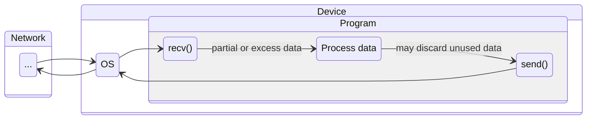
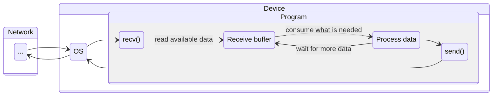

[< back](../../README.md)

## 📨 Receive buffer

### 🧠 Overview
Instead of handling every message immediately, data is accumulated in **controlled and larger chunks**.

---

### 🎯 Purpose
- Improve performance by reducing `SYSCALLS` from repeated OS buffer reads.
- Provide better control over incoming data.

---

### 👀 Visual / Mental Model

#### Before

#### After

---

### ⚙️ How it works
[needs implementation]

---

### 🔗 In the system
Part of the layer that uses it (5-7).

#### [OSI Model](https://en.wikipedia.org/wiki/OSI_model):
| Layer number | Layer        | Responsibility                                 | Protocol                 |
|--------------|--------------|------------------------------------------------|--------------------------|
| 🢂 7          | Application  | Data structuring                               | HTTP, FTP, DNS, SSH      |
| 🢂 6          | Presentation | Encoding, encryption, compression              | TLS/SSL, JPEG, ASCII     |
| 🢂 5          | Session      | Managing sessions between applications         | NetBIOS, RPC             |
| 4            | Transport    | End-to-end delivery, reliability, ports        | TCP, UDP                 |
| 3            | Network      | Logical addressing, routing between networks   | IP, ICMP, routing        |
| 2            | Data Link    | Node-to-node transfer, MAC addressing, framing | Ethernet, Wi-Fi (802.11) |
| 1            | Physical     | Raw bit transmission over physical medium      | Cables, radio, fiber     |

---

<!-- ### 🔎 Further reading -->
<!-- Links or references for deeper understanding -->
