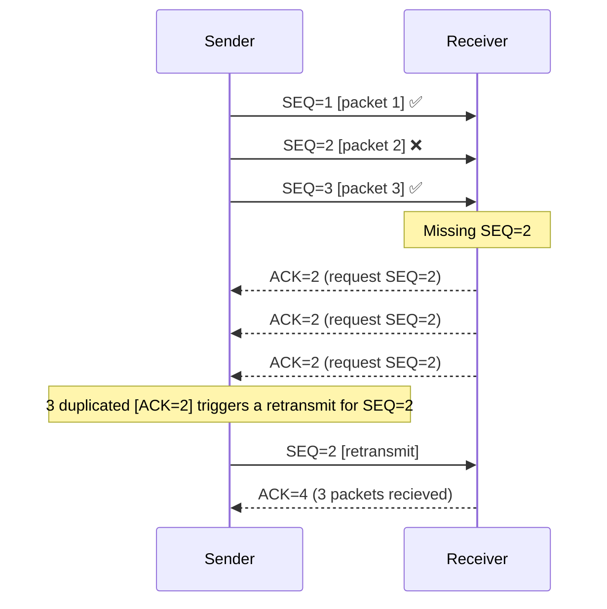
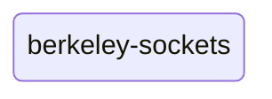

[< back](/README.md#-sections)

## 🔌 TCP

### 🧠 Overview
TCP (Transmission Control Protocol) is a connection-oriented protocol that provides reliable,
ordered delivery of bytes between two endpoints over a network.

---

### 🎯 Purpose
- Reliable, ordered delivery - retransmits lost/corrupt packets, reassembles in order
- Flow/congestion control - don't overwhelm receiver or network
- Connection management - establish/tear down sessions (handshake)

---

### 👀 Visual / Mental Model
#### Connection lifecycle

```mermaid
sequenceDiagram
    participant S as Sender
    participant R as Receiver

    rect rgb(60, 60, 60)
        Note over S, R: Three-way handshake
        S->>R: SYN
        R->>S: SYN-ACK
        S->>R: ACK
    end

    rect rgb(60, 60, 60)
        Note over S, R: Data exchange
        S->>R: Data
        R->>S: ACK
    end

    rect rgb(60, 60, 60)
        Note over S, R: Connection teardown
        S->>R: FIN
        R->>S: ACK
        R->>S: FIN
        S->>R: ACK
    end
```

> SYN (Synchronize) - "I want to connect, here's my starting sequence number"  
> SYN-ACK - server agrees and sends its own starting sequence number  
> ACK (Acknowledge) - "got it"  
> Data - actual payload  
> FIN (Finish) - "I'm done sending, want to close"

#### Data exchnage
Data is broken down into smaller packets.

> SEQ - Sequence number  
> ACK - Acknowledgement number

---

### ⚙️ How it works
TCP is a stream protocol - it has no concept of messages or boundaries.
A read operation may return more or fewer bytes than expected.
It is the application's responsibility to define where one message ends and the next begins.

---

### 🧩 In the system
TCP sits at the transport layer - it handles how data gets there reliably, so higher layers don't have to.

#### [OSI Model](https://en.wikipedia.org/wiki/OSI_model):
|   | Layer number | Layer           | Responsibility                                 | Protocol                 |
|---|--------------|-----------------|------------------------------------------------|--------------------------|
|   | 7            | Application     | Data structuring                               | HTTP, FTP, DNS, SSH      |
|   | 6            | Presentation    | Encoding, encryption, compression              | TLS/SSL, JPEG, ASCII     |
|   | 5            | Session         | Managing sessions between applications         | NetBIOS, RPC             |
| 🢂 | **4**        | **Transport**   | **End-to-end delivery, reliability, ports**    | **TCP, UDP**             |
|   | 3            | Network         | Logical addressing, routing between networks   | IP, ICMP, routing        |
|   | 2            | Data Link       | Node-to-node transfer, MAC addressing, framing | Ethernet, Wi-Fi (802.11) |
|   | 1            | Physical        | Raw bit transmission over physical medium      | Cables, radio, fiber     |

---

### 📚 Subsections 

[berkeley-sockets](/docs/sections/tcp/berkeley_sockets.md)

---

### 🔎 Further reading
[Transmission Control Protocol (TCP)](https://www.rfc-editor.org/rfc/rfc9293)
