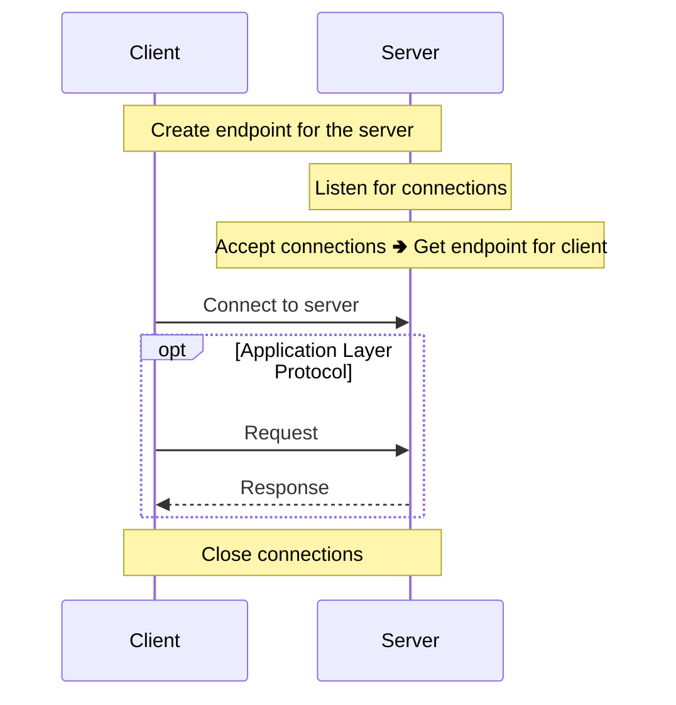

[< back](/README.md#-sections)

## 🔌 TCP connections

### 🧠 Overview
This section implements **low-level networking** via the
[The Berkeley Sockets API](https://csperkins.org/teaching/2007-2008/networked-systems/lecture04.pdf).  
It focuses on the **TCP socket creation, binding, and connection management** at the **Transport Layer**.  
To keep the focus on the **raw connection**, **no application-layer protocols** (like HTTP) are used.  

---

### 🎯 Purpose
Build and configure the server and client endpoints to handle raw connections.

---

### 👀 Visual / Mental Model

---

### ⚙️ How it works
The implementation relies on the [The Berkeley Sockets API](https://csperkins.org/teaching/2007-2008/networked-systems/lecture04.pdf).  
The communication follows a specific lifecycle:

1. **Socket Creation** ([socket()](https://man7.org/linux/man-pages/man2/socket.2.html)):
    - Both endpoints create **file descriptor**s that the OS uses to identify connections.
    - The server uses
        - one to **manage incoming connection requests**,
        - and one for **each client** to **send** and **receive** data.
    - The client uses one to **connect, send, and receive** data.

2. **Binding** ([bind()](https://man7.org/linux/man-pages/man2/bind.2.html)):
    - Assigns a specific **IP address** and **port number** to a socket.

3. **Listening** ([listen()](https://man7.org/linux/man-pages/man2/listen.2.html)):
    - Marks the socket as **passive**: it won't initiate connections, only accept them.
    - The `backlog` parameter sets how many pending connections the OS will queue before refusing new ones.

4. **The Handshake** ([connect()](https://man7.org/linux/man-pages/man2/connect.2.html)/
[accept()](https://man7.org/linux/man-pages/man2/accept.2.html)):
    - The client calls `connect()` targeting the server's address: 
    this triggers the **TCP three-way handshake** (SYN 🢂 SYN-ACK 🢂 ACK) handled by the OS.
    - The server calls `accept()`, which **blocks** until a client connects,
    then returns a new **socket file descriptor** dedicated to that specific client.

5. **Termination** ([close()](https://man7.org/linux/man-pages/man2/close.2.html)):
    - Both sides call `close()` to release the **file descriptors** and signal the end of the connection.

---

### 🧩 In the system
This conecpt that we are using takes place at the **Transport Layer (Layer 4)** of the network stack.

#### [OSI Model](https://en.wikipedia.org/wiki/OSI_model):
|   | Layer number | Layer         | Responsibility                                 | Protocol                 |
|---|--------------|---------------|------------------------------------------------|--------------------------|
|   | 7            | Application   | Data structuring                               | HTTP, FTP, DNS, SSH      |
|   | 6            | Presentation  | Encoding, encryption, compression              | TLS/SSL, JPEG, ASCII     |
|   | 5            | Session       | Managing sessions between applications         | NetBIOS, RPC             |
| 🢂 | **4**        | **Transport** | **End-to-end delivery, reliability, ports**    | **TCP, UDP**             |
|   | 3            | Network       | Logical addressing, routing between networks   | IP, ICMP, routing        |
|   | 2            | Data Link     | Node-to-node transfer, MAC addressing, framing | Ethernet, Wi-Fi (802.11) |
|   | 1            | Physical      | Raw bit transmission over physical medium      | Cables, radio, fiber     |

---

<!-- ### 🔎 Further reading -->
<!-- Links or references for deeper understanding -->
