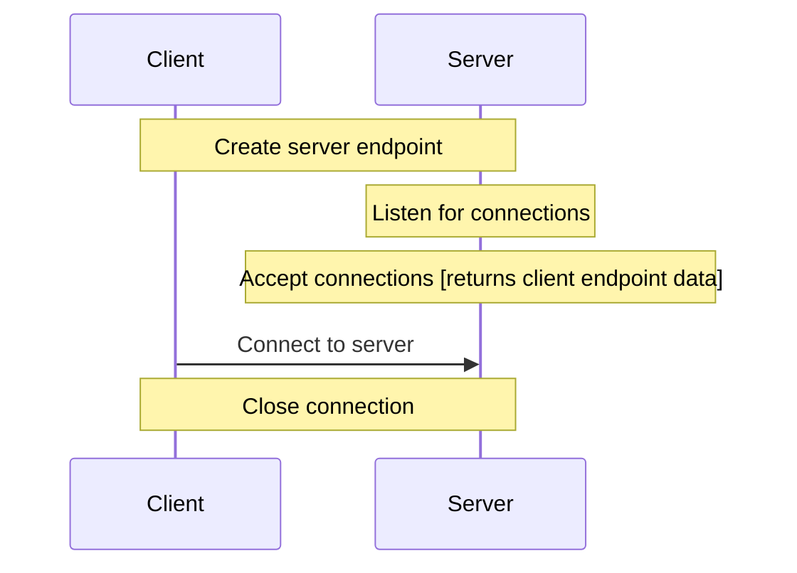

[< back](../README.md)

## 🚀Starting point 

### 🧠 Overview

This section implements **low-level networking** via the
[The Berkeley Sockets API](https://csperkins.org/teaching/2007-2008/networked-systems/lecture04.pdf).

It focuses on the **TCP socket creation, binding, and connection management** at the **Transport Layer**.

To keep the focus on the **raw connection**, **no application-layer protocols** (like HTTP) are used.

---

### 🎯 Purpose
Build and configure the server and client endpoints to handle raw connections and see how they talk to each other under the hood.

---

### 👀 Visual / Mental Model

---

### ⚙️ How it works
The implementation relies on the [The Berkeley Sockets API](https://csperkins.org/teaching/2007-2008/networked-systems/lecture04.pdf).
The communication follows a specific lifecycle:

1. **Socket Creation** ([socket()](https://man7.org/linux/man-pages/man2/socket.2.html)):
    - Both endpoints create a file descriptor that acts as the entry point for network I/O.
    - The server will use this to manage the requested connections from clients.
    - The client will use this to send and receive messages.

2. **Binding** ([bind()](https://man7.org/linux/man-pages/man2/bind.2.html)):
    - Assign an ip address and port number to a socket.

3. **Listening** ([listen()](https://man7.org/linux/man-pages/man2/listen.2.html)):
    - Set the state of a socket to a passive listening state.

4. **The Handshake** ([connect()](https://man7.org/linux/man-pages/man2/connect.2.html)/
[accept()](https://man7.org/linux/man-pages/man2/accept.2.html)):
    - The client initiates a connection to the server's address.
    - The server accepts the requesrted connection and stores the client's socket information.

 *The server's `accept` call blocks until a client connects,  
 then returns a new socket descriptor dedicated specifically to that individual connection.*

5. **Termination** ([close()](https://man7.org/linux/man-pages/man2/close.2.html)):
    - Resources are freed by closing the file descriptors on both ends.

---

### 🔗 In the system
This is the Transport Layer (Layer 4) of the stack.

Below it: The Operating System handles IP routing and hardware interfacing.

Above it: Future sections will implement Application Layer protocols (like a custom text protocol or HTTP)
that define how data is formatted inside the socket's data stream.

---

### 🔎 Further reading
Links or references for deeper understanding
